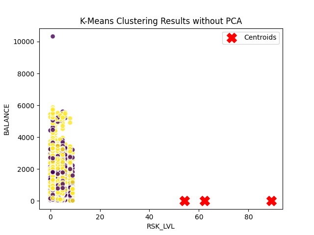

# README
## Initial Process:
1. Take PCA on the data
2. Use K-Means clutering algorithm for unsupervised learning.

### Problem:
By using PCA, we lose all meaning in the dimensions. Instead, we can try to use K-means without using PCA, but it might suffer from the curse of dimensionality.

## Using K-means without PCA
1. use K-means clustering algorithm for unsupervised learning.

## Visualizing the Correlation between the data

## Using a Dendrogram

## Hierarchical clustering
